<p align="center">                        <!--largura--> <!--Altura-->
    
</p>
<div style="text-align: center">
<h3 style="color: #000040;">TOKENIZAÇÃO: UMA TRANSFORMAÇÃO DO MERCADO FINANCEIRO</h3>
</div>
<div style="text-align: right">
<h4>Autor: Lucas Eduardo Rosolem</h4>
<div>Lucas-araras@outlook.com</div>
Graduando em Ciências Econômicas pela Fundação Hermínio Ometto 
</div>
<div style="text-align: right">
<h4>Orientador: Prof. Me Marco Antônio Alves de Souza Junior</h4>
<div>marco@fho.edu.br</div>
Prof. do Núcleo de Negócios da Fundação Hermínio Ometto
</div>
<br></br>
<p align="center">                        <!--largura--> <!--Altura-->
    
</p>
---
```{r echo=FALSE, fig.align='right', out.width="10%"}


```
## 1. INTRODUÇÃO
### Tema: Ativos digitais.
* Após o surgimento do bitcoin surgiram outros ativos digitais, os tokens.
<br></br>
* A pesquisa aborda os tokens do Ethereum e o ecossistema.
<br></br>
* A pesquisa também contribui para a linha histórica da tecnologia do token e visou reintroduzir na literatura brasileira descrevendo esse ecossistema, em torno da tecnologia.
<br></br>
* Segundo SANTOS(2020, p.1853)"Este é um mercado que negociou centenas de trilhões de dólares em uma base global de usuários da Internet em constante expansão."
<p align="center">                        <!--largura--> <!--Altura-->
    
</p>
<p align="center">                        <!--largura--> <!--Altura-->
    
</p>
---
```{r echo=FALSE, fig.align='right', out.width="10%"}


```
<h3 style="color: #000040;"> 1.1 PROBLEMA DE PESQUISA E OBJETIVOS</h3>
<br></br>
<h3>Problema de pesquisa:</h3>
O ecossistema que permite a tokenização de ativos transformará o mercado financeiro?
<br></br>
<h3>Objetivo:</h3>
Avaliar se a tokenização de ativos poderá transformar o mercado financeiro.
<p align="center">                        <!--largura--> <!--Altura-->
    
</p>
<p align="center">                        <!--largura--> <!--Altura-->
    
</p>

---
```{r echo=FALSE, fig.align='right', out.width="10%"}


```
## 2. REVISÃO DE LITERATURA
## O que são Tokens ?
* O termo token possui alguns diferentes significados e usos, mas em âmbito geral é uma espécie de “ficha” de um bem ou de uma particular unidade (SANTOS,et al.2020,p.1857). 

## O que é tokenização?
* De acordo com artigo do [Banco da Reserva Federal de St. Louis](https://bit.ly/3FMoOE4),trata-se do processo de adicionar outros ativos a uma blockchain (SCHÃR,2021).
<p align="center">                        <!--largura--> <!--Altura-->
    
</p>
<p align="center">                        <!--largura--> <!--Altura-->
    
</p>
---
```{r echo=FALSE, fig.align='right', out.width="10%"}


```
## Classificação dos tokens
<p align="center">                        <!--largura--> <!--Altura-->
    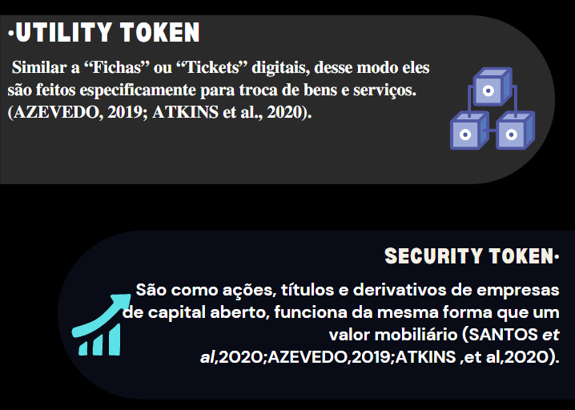
</p>

---
```{r echo=FALSE, fig.align='right', out.width="10%"}


```
<p align="center">                        <!--largura--> <!--Altura-->
    
</p>
<p align="center">                        <!--largura--> <!--Altura-->
    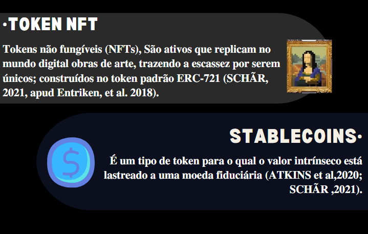
</p>
---
```{r echo=FALSE, fig.align='right', out.width="10%"}


```
<p align="center">                        <!--largura--> <!--Altura-->
    
</p>
<p align="center">                        <!--largura--> <!--Altura-->
    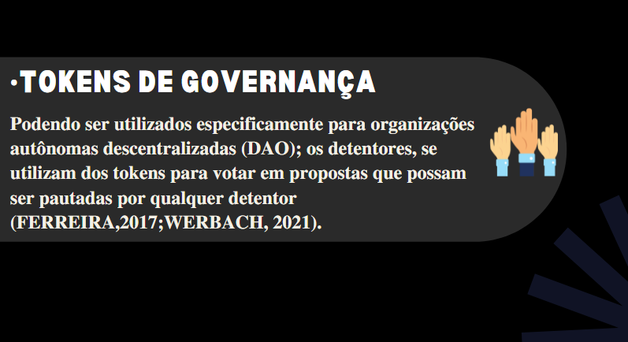
</p>
<p align="center">                        <!--largura--> <!--Altura-->
    
</p>
---
<p align="center">                        <!--largura--> <!--Altura-->
    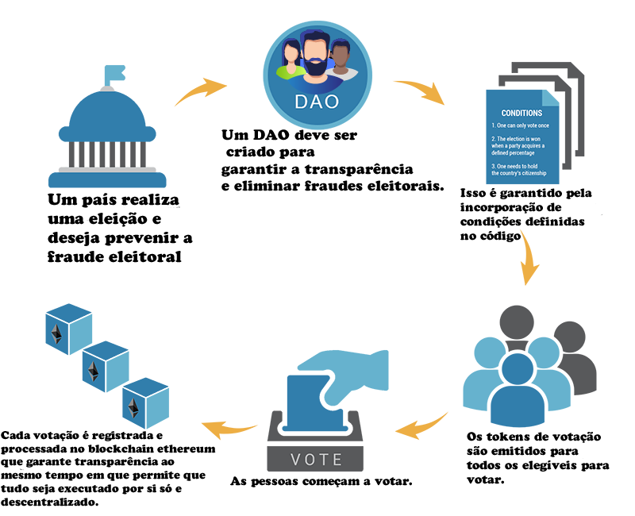
</p>
<p align="center">                        <!--largura--> <!--Altura-->
    
</p>
---
```{r echo=FALSE, fig.align='right', out.width="10%"}


```
<p align="center">                        <!--largura--> <!--Altura-->
    
</p>
<p align="center">                        <!--largura--> <!--Altura-->
    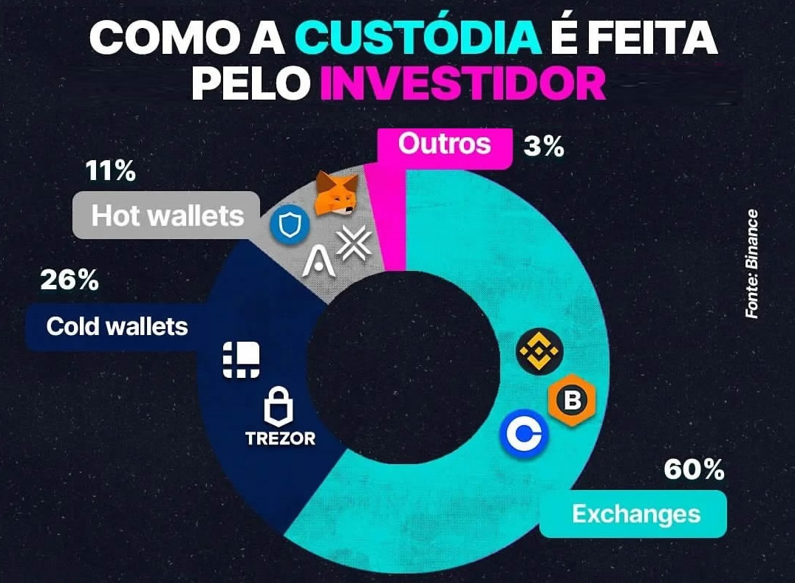
</p>
---
```{r echo=FALSE, fig.align='right', out.width="10%"}


```
## Semelhanças ICO com IPO
<p align="center">                        <!--largura--> <!--Altura-->
    
</p>
<p align="center">                        <!--largura--> <!--Altura-->
    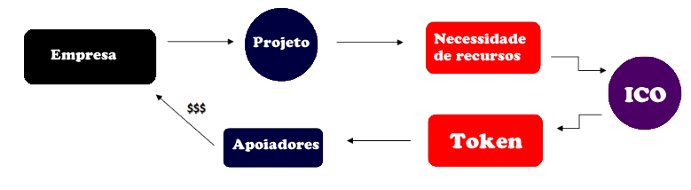
</p>
(ANDRADE,2018;FERREIRA,2017)

<p align="center">                        <!--largura--> <!--Altura-->
    
</p>
---
```{r echo=FALSE, fig.align='right', out.width="10%"}


```
## O que é Defi ?
* Se trata de uma infraestrutura financeira baseada em blockchain construída em plataformas públicas de contratos inteligentes, como a rede Blockchain Ethereum (SCHÃR ,2021;Deshmukh, 2021).

## Como os usuários interagem com os smart contracts? 

* Por meio dos chamados “Dapps”, que replicam os serviços financeiros existentes de uma forma aberta e transparente; essa infraestrutura visa reconstruir e reimaginar serviços de finanças baseado no livro razão distribuído com a tecnologia, dos ativos digitais e contratos inteligentes(DESHMUKH et al. 2021, tradução nossa).
<p align="center">                        <!--largura--> <!--Altura-->
    
</p>
<p align="center">                        <!--largura--> <!--Altura-->
    
</p>
---
```{r echo=FALSE, fig.align='right', out.width="10%"}


```
<p align="center">                        <!--largura--> <!--Altura-->
    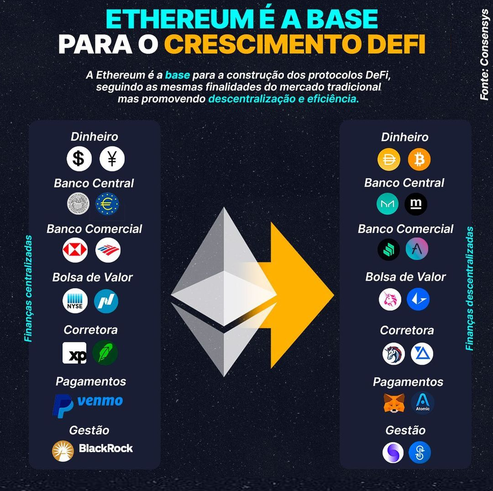
</p>

---
```{r echo=FALSE, fig.align='right', out.width="10%"}


```
## 3. METODOLOGIA

* Para a realização da pesquisa foi levantando de artigos acadêmicos e documentos, sobre os assuntos da pesquisa, e foram buscados em Google, Google acadêmico, Biblioteca Eletrônica Científica Online Scientific Electronic Library e legislação brasileira.
_______________________________________________________________________________________
* Para a pesquisa foi feito buscas de palavras chaves, que foram usados para a busca foram: criptomoedas/ tokens/bitcoin/economia digital/digital assets monograph/descentralized finance” DeFi” monograph/leis sobre propriedade/inovação monográfia/disrupção monografia.
<p align="center">                        <!--largura--> <!--Altura-->
    
</p>
<p align="center">                        <!--largura--> <!--Altura-->
    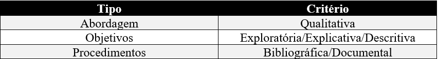
</p>
<p align="center">                        <!--largura--> <!--Altura-->
    
</p>
<p align="center">                        <!--largura--> <!--Altura-->
    
</p>
---
```{r echo=FALSE, fig.align='right', out.width="10%"}


```
### 4. PRINCIPAIS RESULTADOS
* Os security's tokens tem grande potencial em substituir o modo como são negociados atualmente,
participações em empresas(ações), títulos e afins que podem serem considerados valores mobiliários
e tem grandes chances de se perpetuarem no futuro os artigos que foram usados para embasar este
resultado foram os seguintes autores: (SANTOS,2020; ATKINS,2020; AZEVEDO,2019).
_______________________________________________________________________________________
* O Tokens que podem ser usados para governança podem mudar o jeito de como a sociedade hoje em
dia fazem votações para diferentes propostas, isso foi levantado a partir na análise dos artigos dos
seguintes autores: (FERREIRA,2017; WERBACH, 2021).
_______________________________________________________________________________________
* O contexto das tecnologias de registro distribuído (Distributed Ledger Technologies, ou DLT)
podem tornar obsoletas infraestruturas de mercado de capitais existentes que são: (e.g. sistema de
liquidação, compensação e custódia isso pode ser levantado a partir do artigo do autor:
(AZEVEDO,2019, p.46 apud CVM,2017).
<p align="center">                        <!--largura--> <!--Altura-->
    
</p>
<p align="center">                        <!--largura--> <!--Altura-->
    
</p>
---
```{r echo=FALSE, fig.align='right', out.width="10%"}


```
## 5. CONCLUSÃO
<p align="center">                        <!--largura--> <!--Altura-->
    
</p>

* Conclui-se que esse ecossistema ao entorno dos tokens tem grande potencial em substituir todo o sistema de mercado financeiro tradicional como é hoje em dia, causando uma transformação a longo prazo.
_______________________________________________________________________________________

* A pesquisa trouxe fortes evidências de um novo rumo do mercado.

* Pela primeira vez na história as empresas podem emitir seu valor mobiliário por meio do security token.

<p align="center">                        <!--largura--> <!--Altura-->
    
</p>
<p align="center">                        <!--largura--> <!--Altura-->
    
</p>
---
```{r echo=FALSE, fig.align='right', out.width="10%"}


```
### 6. REFERÊNCIAS

<p align="center">                        <!--largura--> <!--Altura-->
    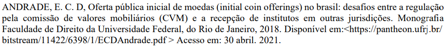
</p>
<p align="center">                        <!--largura--> <!--Altura-->
    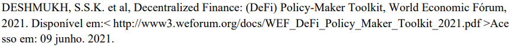
</p>
<p align="center">                        <!--largura--> <!--Altura-->
    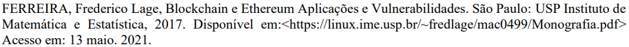
</p>
<p align="center">                        <!--largura--> <!--Altura-->
    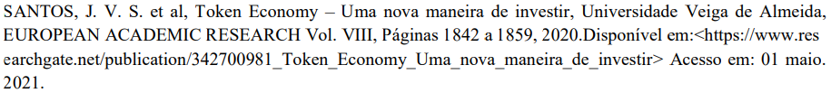
</p>
<p align="center">                        <!--largura--> <!--Altura-->
    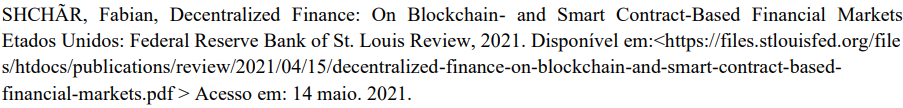
</p>

---
```{r echo=FALSE, fig.align='right', out.width="10%"}


```
<p align="center">                        <!--largura--> <!--Altura-->
    
</p>
<p align="center">                        <!--largura--> <!--Altura-->
    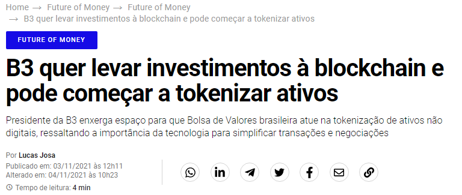
</p>
<p align="center">                        <!--largura--> <!--Altura-->
    
</p>
              [Clique aqui, para ver a notícia completa](https://bit.ly/3xvgrtI).
---
```{r echo=FALSE, fig.align='right', out.width="10%"}


```
<p align="center">                        <!--largura--> <!--Altura-->
    
</p>
<p align="center">                        <!--largura--> <!--Altura-->
    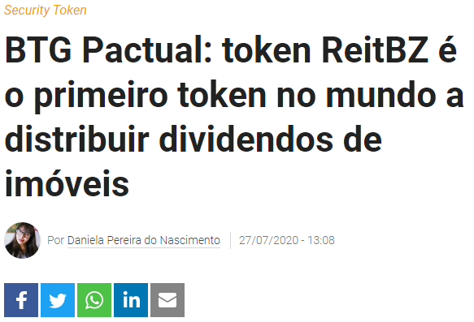
</p>
<p align="center">                        <!--largura--> <!--Altura-->
    
</p>
              [Clique aqui, para ver a notícia completa](https://bit.ly/3nVHefy).
---
```{r echo=FALSE, fig.align='right', out.width="10%"}


```
<p align="center">                        <!--largura--> <!--Altura-->
    
</p>
<p align="center">                        <!--largura--> <!--Altura-->
    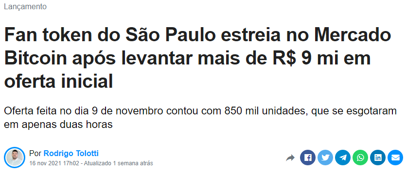
</p>
<p align="center">                        <!--largura--> <!--Altura-->
    
</p>
              [Clique aqui, para ver a notícia completa](https://bit.ly/3xq9UQX)
---
```{r echo=FALSE, fig.align='right', out.width="10%"}


```
<p align="center">                        <!--largura--> <!--Altura-->
    
</p>
<p align="center">                        <!--largura--> <!--Altura-->
    
</p>
<p align="center">                        <!--largura--> <!--Altura-->
    
</p>
<p align="center">                        <!--largura--> <!--Altura-->
    
</p>
---
```{r echo=FALSE, fig.align='right', out.width="10%"}


```
<p align="center">                        <!--largura--> <!--Altura-->
    
</p>
<p align="center">                        <!--largura--> <!--Altura-->
    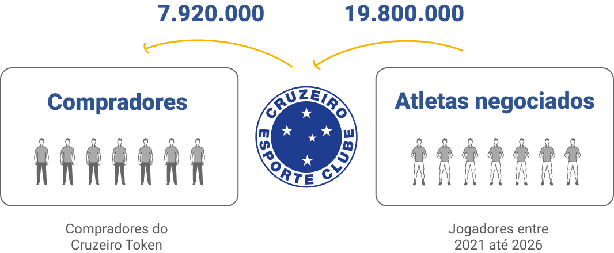
</p>
<p align="center">                        <!--largura--> <!--Altura-->
    
</p>
              [Clique aqui, para ver a notícia completa](https://glo.bo/3FKL4xY)
---
```{r echo=FALSE, fig.align='right', out.width="10%"}


```
#  Muito obrigado !
###-Meus contatos

* [whatsapp](https://bit.ly/3uMmzeI)

* [Telegram](https://bit.ly/2QjsTeT)

* [Instagram](https://bit.ly/3ybr0Sj)

* [Linkedin](https://bit.ly/2RU9X6B)

* [Facebook](https://bit.ly/33L8m5P)

* [Github](https://bit.ly/3ybqALJ)
_______________________________________________________________________________________

* [Artigo versão final completa](https://bit.ly/3FTjazX)


---
```{r echo=FALSE, fig.align='right', out.width="15%"}


```
### Tecnologias utilizadas para esta apresentação: 

<p align="center">
    
</p>


